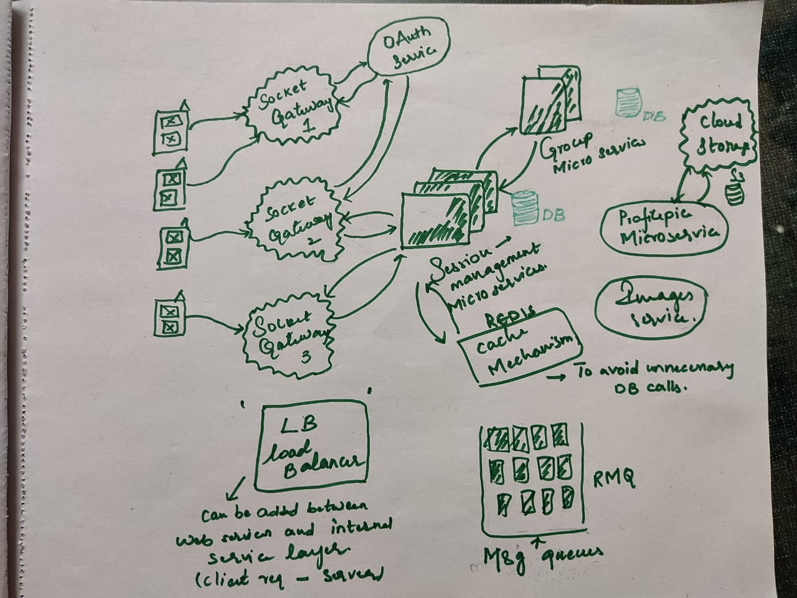

## Good to have features (Inspired by WhatsApp)
    One-one messaging
    Group messaging
    File uploads
    Read receipts
    Last seen status

### With my knowledge I have come up with this simple architecture by keeping one-one, group messaging in mind. 

Here is a glimpse of the rough architecture for the above.

### Architecture Explanation
    1. For any chat application, there is no efficient way of exchanging info other than using "Web Sockets". Sockets are reliable if we use them with proper security guidelines.
    2. Flow to one-one messaging: UserA-UserB 
        I. Clients send message metadata including messageData, senderInfo, recipientInfo etc. through sockets to server.
        II. It will first go through auth middleware to validate user login info
        III. The metadata then passes to session management services (Responsible for maintaining info such as which user connects to which device as a basic example usage)
        IV. Session service then communicates to application server to fetch the sender/recipient info.
        V. After fetching the userInfo, it then sends back the necessary info to sockets and then recipient receives the message.
    3. Flow to group messaging: 
        I. Session servers maintain their own db to store such info. Session servers then communicate with group services that we maintain mapping of groupIds with userIds. This will tell how many users are there in group for example.
        II. Group service gives the necessary info back to session service, then to sockets. 
        III. Finally all group users will get the message.
    
    We can improve the above approach by adding load balancers between client and internal service layers. It will reduce the load on single micro service, resulting the faster communication.
    
    Additionally, when message sending fails, there needs to be retry mechanism and that is possible using message queueing system such as RabbitMQ. We can configure retry limit and ensure for successful attempt of sending message. Incase, if message sending fails then through the acknowledgement we can notify senders about their message status.

    Also, polling mechanism between client and server ensures user status whether that user is online/offline.
    

